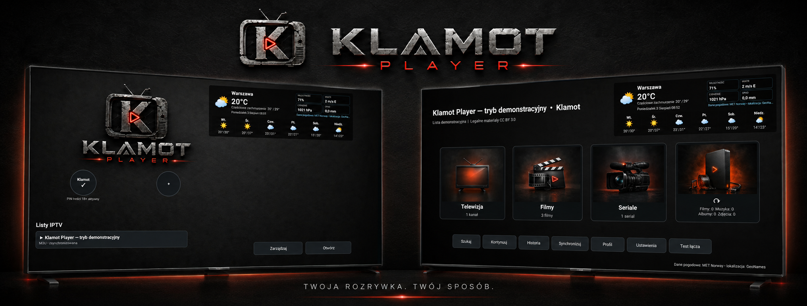

# Klamot Player

**Klamot Player** to bezpłatny odtwarzacz IPTV przeznaczony do korzystania z własnych źródeł użytkownika. Aplikacja jest dostępna w kilku wariantach dla urządzeń z Android TV, Android Mobile, Amazon Fire TV / Fire OS oraz dla środowiska emulatora.

🌐 Oficjalna strona projektu: https://www.klamot.com.pl/

## Dostępne wersje

| Platforma | Wersja | Pobieranie |
|---|---:|---|
| Android TV | **2.0.17 (19)** | [⬇ Pobierz APK](https://github.com/piotrklamot-tech/klamot-player/releases/download/android-tv-v2.0.17/Klamot-Player-Android-TV-2.0.17.apk) |
| Android Mobile | **1.0.2 (18)** | [⬇ Pobierz APK](https://github.com/piotrklamot-tech/klamot-player/releases/download/mobile-v1.0.2/Klamot-Player-Mobile-1.0.2.apk) |
| Emulator | **2.0.13 (15)** | [⬇ Pobierz APK](https://github.com/piotrklamot-tech/klamot-player/releases/download/emulator-v2.0.13/Klamot-Player-Emulator-2.0.13.apk) |
| Amazon Fire TV / Fire OS | **2.0.13 (15)** | [⬇ Pobierz APK](https://github.com/piotrklamot-tech/klamot-player/releases/download/fireos-v2.0.13/Klamot-Player-FireOS-2.0.13.apk) |

Pełna lista publicznych wydań znajduje się w sekcji [Releases](https://github.com/piotrklamot-tech/klamot-player/releases).

## Najważniejsze informacje

- odtwarzanie treści z własnych źródeł użytkownika,
- obsługa urządzeń Android TV i Android Mobile,
- osobna wersja dla Amazon Fire TV / Fire OS,
- publiczne pliki instalacyjne udostępniane przez GitHub Releases,
- projekt jest rozwijany niezależnie i bezpłatnie.

## Jak zacząć

1. Wybierz wersję odpowiednią dla swojego urządzenia.
2. Pobierz plik APK z tabeli powyżej.
3. Zainstaluj aplikację na swoim urządzeniu.
4. Uruchom Klamot Player i dodaj własne źródło lub listę IPTV.

## Ważne

Klamot Player **nie udostępnia kanałów telewizyjnych, filmów, seriali ani gotowych list IPTV**. Użytkownik korzysta wyłącznie z własnych, legalnie dostępnych źródeł.

To repozytorium zawiera wyłącznie publiczne pliki instalacyjne i informacje o wydaniach. Nie zawiera kodu źródłowego, danych logowania, kluczy podpisu ani konfiguracji użytkowników.

---

**Klamot Player — Twoja rozrywka. Twój sposób.**
